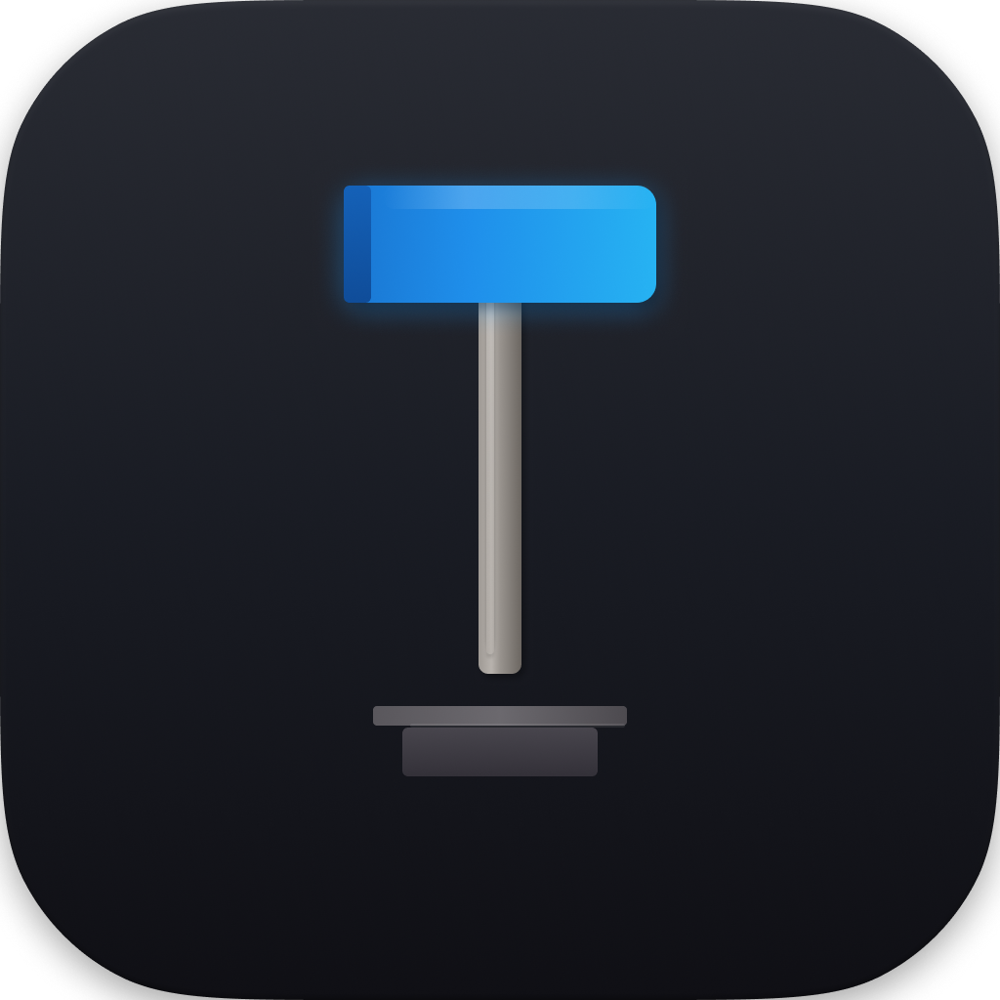
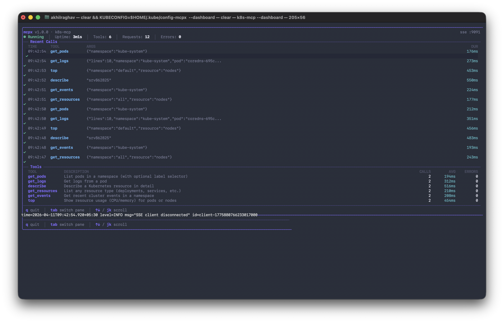

<p align="center">
  
  <h1 align="center">hamr</h1>
  <p align="center"><strong>Build MCP servers in Go. Optimized for token cost.</strong></p>
  <p align="center">
    <a href="https://pkg.go.dev/github.com/AKhilRaghav0/hamr"></a>
    <a href="https://goreportcard.com/report/github.com/AKhilRaghav0/hamr"></a>
    <a href="https://github.com/AKhilRaghav0/hamr/actions/workflows/ci.yml"></a>
    <a href="https://github.com/AKhilRaghav0/hamr/releases/latest"></a>
    <a href="LICENSE"></a>
    <a href="https://github.com/AKhilRaghav0/hamr/wiki"></a>
  </p>
</p>

---

## What is this?

MCP (Model Context Protocol) lets AI assistants like Claude, Cursor, and Windsurf call external tools. An MCP server is basically a plugin that gives AI the ability to *do things* — query your database, check your Kubernetes cluster, search your codebase, whatever you need.

The problem is that building an MCP server in Go means writing a ton of boilerplate. You have to manually define JSON schemas, handle JSON-RPC framing, parse and validate inputs, wire up transport, manage errors — and you end up with 200+ lines of ceremony before you even get to your actual logic.

hamr fixes that. You write a Go struct for your input, a function for your logic, and one line to register it. hamr handles everything else — schema generation, validation, transport, middleware, the whole protocol. Your struct tags *are* your schema.

Think of it like [Cobra](https://github.com/spf13/cobra) but for MCP servers instead of CLI apps.

## Show me the code

Here's a complete, working MCP server:

```go
package main

import (
    "context"
    "log"

    "github.com/AKhilRaghav0/hamr"
)

type SearchInput struct {
    Query      string `json:"query" desc:"search query"`
    MaxResults int    `json:"max_results" desc:"max results" default:"10"`
    Format     string `json:"format" desc:"output format" enum:"json,text,csv"`
}

func Search(ctx context.Context, input SearchInput) (string, error) {
    // your actual search logic here
    return "results for: " + input.Query, nil
}

func main() {
    s := hamr.New("my-server", "1.0.0")
    s.Tool("search", "Search for information", Search)
    log.Fatal(s.Run())
}
```

That's it. Build it, point Claude Desktop at the binary, and Claude can now call your search tool. The JSON schema gets generated from `SearchInput` automatically — the `desc` tag becomes the description, `default` sets the default value, `enum` restricts the allowed values. You never touch JSON schema by hand.

## Why hamr instead of the official Go SDK?

The official MCP Go SDK (`github.com/modelcontextprotocol/go-sdk`) is the reference implementation, and it's the right choice if you need first-party support, output schemas, progress tracking, or StreamableHTTP as soon as the spec ships it. It will always be first to get new protocol features.

hamr is a higher-level framework built on top of the same protocol. The tradeoff is ergonomics and token cost in exchange for some flexibility. Here's how they compare:

| | Official go-sdk | hamr |
|---|---|---|
| Schema generation | Struct tags (`jsonschema`) | Struct tags (`desc`, `default`, `enum`, `min`, `max`, `pattern`) |
| Handler signature | `func(ctx, *CallToolRequest, In) (*CallToolResult, Out, error)` | `func(ctx, In) (string, error)` |
| Pre-built middleware | None shipped | Logger, Recovery, RateLimit, Auth, Timeout, Cache |
| Tool groups (lazy loading) | No | Yes — AI sees groups, not 20 schemas at once |
| Minimal schema mode | No | Yes — strip verbose fields, save tokens |
| Response truncation | No | Yes — auto-cap large outputs |
| Cost tracking | No | Yes — token estimates per tool call |
| Toolbox collections | No | FileSystem, HTTP, Shell, Git, Database |
| TUI dashboard | No | Live terminal monitoring |
| CLI scaffolder | No | `hamr init my-server` |
| Test client | InMemoryTransport | `hamrtest.NewClient(t, s)` |
| Official backing | Yes | No |
| Output schemas | Yes | No |
| Progress tracking | Yes | No |
| StreamableHTTP | Yes | Planned |

If you're prototyping or shipping production MCP servers where token overhead matters, hamr's extra layer pays for itself. If you need the latest spec features or official support, use go-sdk directly.

## Getting started

Install the CLI:

```bash
go install github.com/AKhilRaghav0/hamr/cmd/hamr@latest
```

Scaffold a new project:

```bash
hamr init my-server
cd my-server
go run .
```

This generates a working project with an example tool, a Makefile, and a ready-to-paste Claude Desktop config. The generated code compiles and runs immediately.

Or if you already have a Go project, just add the dependency:

```bash
go get github.com/AKhilRaghav0/hamr
```

## How it works

### Your struct tags define the schema

Every tool in MCP needs a JSON Schema that tells the AI what arguments the tool accepts. With hamr, you define a Go struct and the schema is generated automatically using reflection.

```go
type CreateFileInput struct {
    Path    string   `json:"path" desc:"file path to create"`
    Content string   `json:"content" desc:"file contents"`
    Mode    int      `json:"mode" desc:"file permissions" default:"644" min:"0" max:"777"`
    Tags    []string `json:"tags" desc:"file tags" optional:"true"`
    Format  string   `json:"format" desc:"output format" enum:"json,yaml,toml"`
}
```

Supported tags:

| Tag | What it does | Example |
|-----|-------------|---------|
| `desc` | Field description shown to the AI | `desc:"search query"` |
| `default` | Value used when the field is omitted | `default:"10"` |
| `enum` | Restricts to specific values | `enum:"json,xml,csv"` |
| `optional` | Marks field as not required | `optional:"true"` |
| `min` / `max` | Numeric bounds | `min:"1" max:"100"` |
| `pattern` | Regex validation for strings | `pattern:"^[a-z]+$"` |

Supported Go types: `string`, `int`, `float64`, `bool`, `[]T`, `map[string]T`, `*T`, nested structs, `time.Time`. They all map to the right JSON Schema types automatically.

### Your function signature is the handler

Tool handlers follow a simple pattern:

```go
func MyTool(ctx context.Context, input MyInput) (string, error) {
    // do the thing
    return "result", nil
}
```

hamr also supports returning multiple content blocks or structured results:

```go
// Return multiple content blocks (text + images, etc.)
func FetchImage(ctx context.Context, in Input) ([]hamr.Content, error) {
    return []hamr.Content{
        hamr.TextContent("Here's the image:"),
        hamr.ImageContent("image/png", base64Data),
    }, nil
}

// Return a Result with explicit error flag
func Risky(ctx context.Context, in Input) (hamr.Result, error) {
    if somethingFailed {
        return hamr.ErrorResult("it broke"), nil
    }
    return hamr.NewResult(hamr.TextContent("it worked")), nil
}
```

### Middleware works like you'd expect

If you've used middleware in any HTTP framework, this is the same idea. Middleware wraps your tool handlers and runs before/after each call.

```go
s := hamr.New("server", "1.0.0")

// Global middleware — applies to all tools
s.Use(
    middleware.Logger(),                    // logs every call with timing
    middleware.Recovery(),                  // catches panics, returns error instead of crashing
    middleware.RateLimit(10),               // 10 requests per second per tool
    middleware.Timeout(30 * time.Second),   // kills slow calls
)

// Per-tool middleware — only applies to this tool
s.Tool("expensive_lookup", "Slow external API call", handler,
    middleware.Cache(5 * time.Minute),
    middleware.Timeout(60 * time.Second),
)
```

Built-in middleware: **Logger**, **Recovery**, **RateLimit**, **Auth**, **Timeout**, **Cache**. You can also write your own — it's just a function that wraps the next handler.

### Transport is one line

```go
s.Run()                          // stdio — works with Claude Desktop, Cursor, etc.
s.RunSSE(":8080")                // SSE over HTTP — works with web-based MCP clients
s.RunSSEWithDashboard(":8080")   // SSE + live TUI dashboard in your terminal
```

### The dashboard is real

When you run with `RunSSEWithDashboard`, you get a live terminal dashboard that shows every tool call in real time — which tool was called, what arguments it received, how long it took, whether it succeeded or failed. Built with [Bubbletea](https://github.com/charmbracelet/bubbletea).

This is the k8s-mcp example connected to a real Kubernetes cluster:



You can also run the devtools example with `--dashboard` to see it in action.

## Token optimization

Every tool schema you register gets sent to the AI on each conversation turn. With a large server — say 20 tools with detailed schemas — that's hundreds of tokens spent before the AI has done anything useful. These features exist to control that cost.

### Tool groups

Instead of exposing all tools upfront, you can organize them into named groups. The AI sees the group names and descriptions first, and only loads the full schemas for the groups it actually needs.

```go
s := hamr.New("my-server", "1.0.0")

// Register tools inside a named group
s.Group("filesystem", "Read and write local files",
    hamr.GroupTool("read_file", "Read a file", ReadFile),
    hamr.GroupTool("write_file", "Write a file", WriteFile),
    hamr.GroupTool("list_dir", "List directory contents", ListDir),
)

s.Group("database", "Query the database",
    hamr.GroupTool("query", "Run a SELECT query", QueryDB),
    hamr.GroupTool("list_tables", "List available tables", ListTables),
)
```

The AI sees two tools instead of five. If the task doesn't touch the database, those three schemas are never loaded. On a 20-tool server, this can cut schema token overhead by 80% or more depending on what the AI actually uses.

### WithMinimalSchemas

Full JSON Schema includes `$schema` declarations, `additionalProperties`, format annotations, and other fields that are useful for validation but redundant when you're just telling an AI what arguments a tool takes. `WithMinimalSchemas` strips those fields before the schema is sent.

```go
s := hamr.New("my-server", "1.0.0",
    hamr.WithMinimalSchemas(),
)
```

No code changes to your tools. The schemas still work — they're just leaner. On a server with many tools, this typically saves 15–25% of schema tokens.

### MaxResponseTokens

Tool responses can be arbitrarily large. A `git log` over a big repo or a database query with thousands of rows can return tens of thousands of tokens that bloat the context window. `MaxResponseTokens` caps any single tool response before it reaches the AI.

```go
s.Tool("git_log", "Show commit history", GitLog,
    hamr.MaxResponseTokens(500),
)
```

If the response would exceed 500 tokens, hamr truncates it and appends a note explaining the truncation so the AI knows the output was cut. You can also set a server-wide default:

```go
s := hamr.New("my-server", "1.0.0",
    hamr.WithDefaultMaxResponseTokens(1000),
)
```

### CostTracker

`CostTracker` attaches to a server and records estimated token usage per tool call — schema tokens sent to the AI, response tokens returned, and a running total. Useful for understanding where your context budget actually goes.

```go
tracker := hamr.NewCostTracker()
s := hamr.New("my-server", "1.0.0",
    hamr.WithCostTracker(tracker),
)

// After some calls...
report := tracker.Report()
fmt.Printf("Total estimated tokens: %d\n", report.TotalTokens)
fmt.Printf("By tool:\n")
for tool, usage := range report.ByTool {
    fmt.Printf("  %s: %d schema + %d response\n", tool, usage.SchemaTokens, usage.ResponseTokens)
}
```

These are estimates based on character counts, not exact BPE counts. They're useful for relative comparisons — figuring out which tools are expensive — not for billing.

### EstimateSchemaTokens

Before deploying a server, you can check how many tokens its schemas will consume on each call:

```go
s := hamr.New("my-server", "1.0.0")
s.Tool("search", "Search for information", Search)
s.Tool("create_file", "Create a file", CreateFile)
// ... more tools

estimate := s.EstimateSchemaTokens()
fmt.Printf("Schema overhead per call: ~%d tokens\n", estimate)
```

This runs before `s.Run()`, so you can catch bloated schemas during development. If the number is high, reach for tool groups or `WithMinimalSchemas`.

## Pre-built tool collections

If you just want to get something running fast, hamr ships with ready-made tool collections:

```go
import "github.com/AKhilRaghav0/hamr/toolbox"

s := hamr.New("my-server", "1.0.0")
s.AddTools(toolbox.FileSystem("/safe/path"))  // read_file, write_file, list_dir, search_files
s.AddTools(toolbox.HTTP())                     // http_get, http_post, fetch_url
s.AddTools(toolbox.Shell("/work/dir"))         // run_command (sandboxed)
s.AddTools(toolbox.Git("/repo"))               // git_status, git_diff, git_log, git_blame
s.AddTools(toolbox.Database(db))               // query, list_tables, describe_table
```

Each collection is sandboxed. The filesystem tools can't escape their root directory (symlink attacks are blocked). The shell tools support command allowlists. The database tools only allow SELECT queries. These aren't toys — they went through a security review.

## Testing your tools

hamr includes a test client that talks to your server in-memory. No network, no processes, no transport layer — just direct function calls with proper MCP protocol handling.

```go
func TestSearch(t *testing.T) {
    s := hamr.New("test", "1.0.0")
    s.Tool("search", "Search", Search)

    client := hamrtest.NewClient(t, s.NewTestHandler())

    // Call a tool
    result, err := client.CallTool("search", map[string]any{
        "query": "golang",
    })
    if err != nil {
        t.Fatal(err)
    }
    if !strings.Contains(result.Text(), "golang") {
        t.Errorf("expected results to contain 'golang', got: %s", result.Text())
    }

    // Verify validation works
    _, err = client.CallTool("search", map[string]any{})
    if err == nil {
        t.Error("expected error for missing required field")
    }
}
```

## Add your server to Claude Desktop

Build your server:

```bash
go build -o my-server .
```

Add it to Claude Desktop's config:

```json
{
  "mcpServers": {
    "my-server": {
      "command": "/absolute/path/to/my-server"
    }
  }
}
```

Config file location:
- **macOS:** `~/Library/Application Support/Claude/claude_desktop_config.json`
- **Windows:** `%APPDATA%\Claude\claude_desktop_config.json`

Restart Claude Desktop and your tools are available. That's the whole setup.

## CLI tools

```bash
hamr init my-server      # scaffold a new project (compiles immediately)
hamr validate             # check your server for common mistakes
hamr dev                  # hot-reload dev server (rebuilds on file changes)
hamr version              # print version
```

## Real-world examples

The [examples](examples/) directory has complete, runnable servers:

| Example | What it does | Lines |
|---------|-------------|-------|
| [basic](examples/basic) | Minimal server with 4 simple tools | 65 |
| [devtools](examples/devtools) | Full dev environment — files, git, shell, grep | 290 |
| [k8s-mcp](examples/k8s-mcp) | Kubernetes cluster tools — pods, logs, events | 157 |
| [postgres-mcp](examples/postgres-mcp) | Database query tools for PostgreSQL | 250 |
| [middleware](examples/middleware) | Demonstrates all middleware features | 80 |

The k8s example is probably the most interesting. You point it at a cluster and Claude can ask "what pods are crashing?" and get a real answer.

## Project structure

```
hamr/
  hamr.go            Public API — New(), Tool(), Resource(), Prompt(), Run()
  schema/             Auto JSON Schema generation from Go types
  validate/           Input validation engine
  middleware/         Logger, Recovery, RateLimit, Auth, Timeout, Cache
  transport/          stdio and SSE (JSON-RPC 2.0)
  tui/                Live monitoring dashboard (Bubbletea)
  toolbox/            Pre-built tool collections
  hamrtest/           Test client for unit testing
  cmd/hamr/           CLI — init, validate, dev
  examples/           Working examples
```

## Community

- [Reddit discussion](https://www.reddit.com/r/golang/comments/1sib0rh/i_got_tired_of_writing_300_lines_of_jsonrpc/) — the original post on r/golang
- [Wiki](https://github.com/AKhilRaghav0/hamr/wiki) — full documentation

## Contributing

We'd love contributions. The codebase is straightforward Go — no code generation, no magic, just reflection and struct tags.

```bash
git clone https://github.com/AKhilRaghav0/hamr.git
cd hamr
make test    # runs all tests with race detector
make lint    # runs go vet
```

See [CONTRIBUTING.md](CONTRIBUTING.md) for details. If you're not sure where to start, check the issues — there's always something to pick up.

## License

MIT. See [LICENSE](LICENSE).
